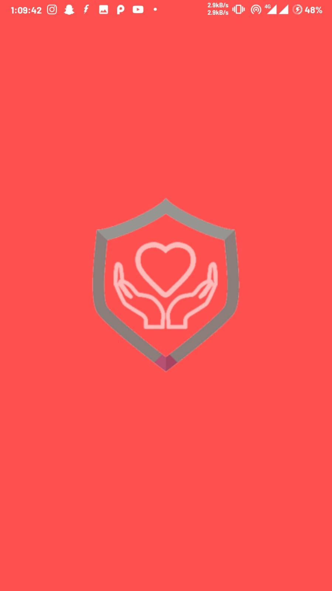
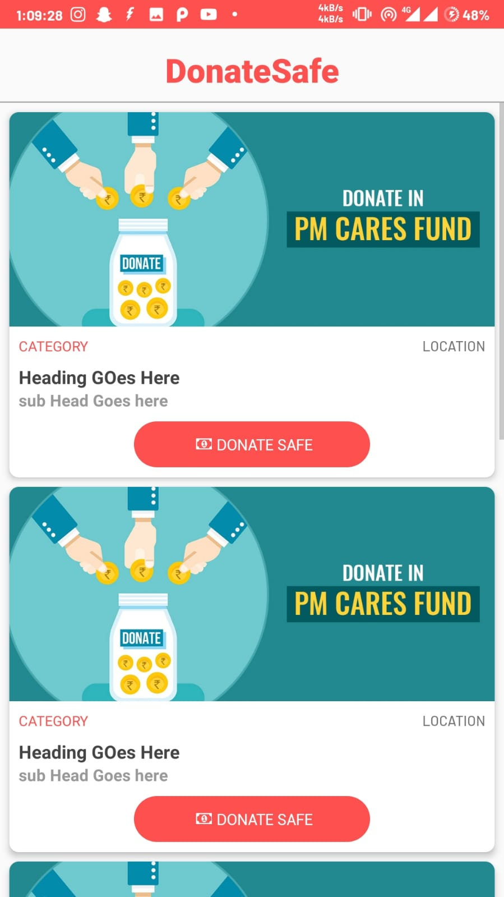
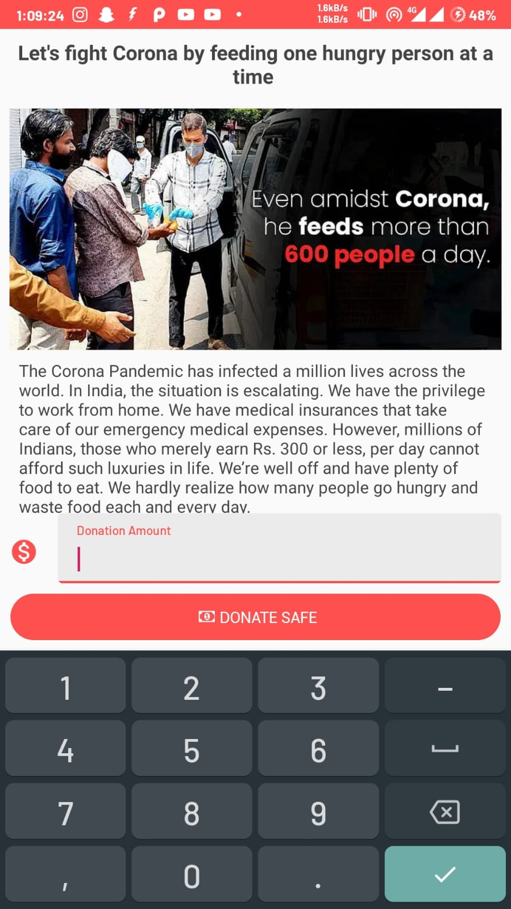

<h1>Donate Safe </h1>

  
  
  

#### Block chain based donation platform
Prototype built on Android integrated with [Ethereum](https://ethereum.org/) and [Matic](https://matic.network/).

User is Prompted with various Donation Schemes available on various platforms

And User can make a Cryptocurrency payment securely.

## Backstory
This app is a blockchain-based charity app deployed on the ethereum test network. The core purpose of this app is a transparent charity platform on Blockchain. Due to the rise of Coronavirus, there are a huge number of growing fake charities that emerged and which are looting people during these tough times. As thousands of people are diagnosed with COVID-19 and are unable to work, many are finding it hard to make ends meet and are asking for donations. At the same time, scammers are creating fake GoFundMe pages designed to tug at your heartstrings and empty your wallet.

This issue has been solved and addressed by a blockchain-based transparent charity web app to ensure people do not get cheated as there is transparency in each and every step. By minimizing administrative costs through automation, providing more accountability through traceable giving milestones, and allowing donors to see more clearly where their funds are going, blockchain may help restore some of the lost credibility to charities that prove worthy of the public’s trust.

## Screenshots
<table>
    <tr>
     <td><kbd></kbd></td>
     <td><kbd></kbd></td>
     <td><kbd></kbd></td>
    </tr>
</table>

## How to Edit Files

* Download [Android Studio](https://developer.android.com/studio)
* Clone the whole repo
* Select open project and Point the cloned repo in the Android studio

## Show your support

Give a ⭐️ if this project helped you!

 **Made with ❤ Nitish Gadangi**
